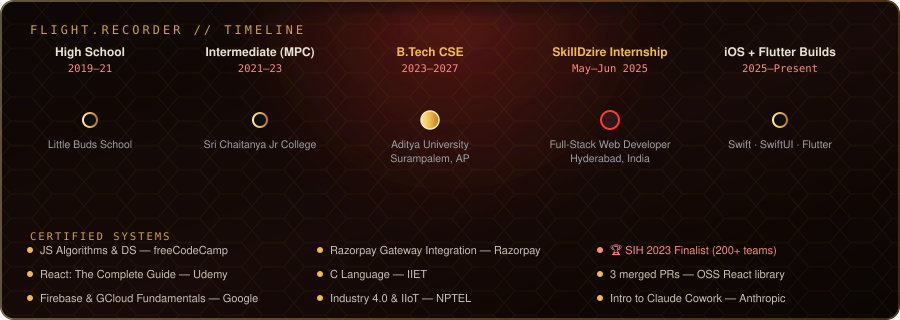
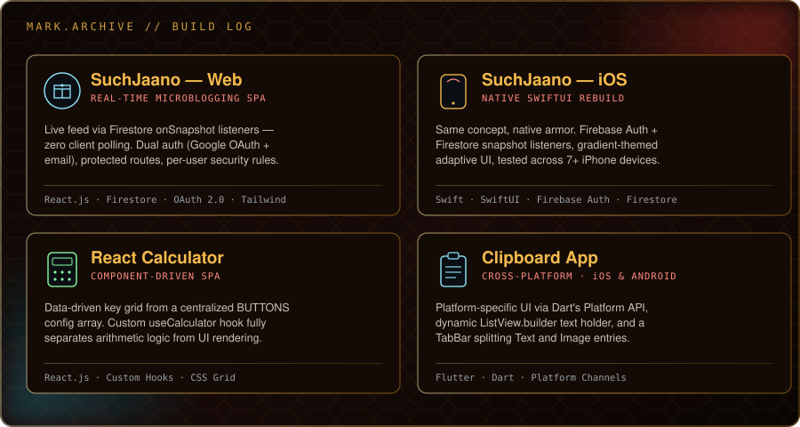

 

 

## `// SYSTEM LOG — ABOUT`

I'm **Vemparala Sri Satya Raghuram**, a B.Tech Computer Science student (Aditya University, 2023–2027) who builds across the full stack of a product — the server, the browser, and the phone in your pocket.

On one suit layer, I'm a **MERN Stack Developer**: production SPAs with MongoDB, Express, React and Node, JWT auth, Google OAuth, Firebase Firestore, and Razorpay payments — hardened during a Full-Stack Web Developer internship at **SkillDzire**. On the other, I build **native iOS apps in Swift/SwiftUI** and **cross-platform apps in Flutter**, shipping real-time, Firebase-backed experiences tested across 7+ iPhone devices. I approach both the same way — thinking in clean separations of UI and logic, whether that's MVVM in Swift or hooks in React.

Same core system, different armor for different missions.

 

## `// SUIT.LOADOUT — TECH STACK`

**Languages**
 

**Frontend & Mobile**
 

**Backend, Cloud & DevOps**
 

**Tools & Integrations**
 

 

## `// FLIGHT RECORDER — TIMELINE`

 

## `// MISSION LOG — EXPERIENCE`

**Full-Stack Web Developer Intern** · SkillDzire · *May 2025 – Jun 2025* · Hyderabad, India
- Architected and deployed 4+ production-grade full-stack apps end-to-end — UI, REST APIs, and cloud deployment on Vercel / Firebase Hosting.
- Built Razorpay payment integration with HMAC-SHA256 signature validation and webhook-driven order syncing.
- Shipped JWT-authenticated REST APIs with real-time Firebase Firestore sync (`onSnapshot`) and GitHub Actions CI/CD pipelines.
- Hit 95+ Google Lighthouse scores through lazy loading, code splitting, and asset optimization.

 

## `// ARMORY — FEATURED BUILDS`

<b>SuchJaano — Web</b> 

  

<b>SuchJaano — iOS</b> 

  

<b>React Calculator</b> 

  

<b>Clipboard App</b> 

> ⚠️ Repo links intentionally omitted here — confirm which GitHub account actually hosts these four project repos before adding links, so nothing 404s for a visitor.

 

## `// SIGNAL LOG — PINNED REPOSITORIES`

| Repo | Focus | Stack |
|---|---|---|
| [`iOS`](https://github.com/vssraghuram/iOS) | Native iOS builds | Swift |
| [`DSA`](https://github.com/vssraghuram/DSA) | Data structures & algorithms practice | C++ |
| [`LeetCode`](https://github.com/vssraghuram/LeetCode) | LeetCode problem-solving journey | C++ |
| [`VSR`](https://github.com/vssraghuram/VSR) | Personal portfolio / web build | JavaScript |

 

## `// COMMENDATIONS — CERTIFICATIONS & ACHIEVEMENTS`

- 🏆 **Finalist** — Smart India Hackathon 2023 (200+ teams)
- 🔧 Contributed 3 merged PRs to an open-source React component library
- 📜 JS Algorithms & Data Structures — freeCodeCamp
- 📜 React: The Complete Guide — Udemy
- 📜 Firebase & Google Cloud Fundamentals — Google Developers
- 📜 Razorpay Gateway Integration — Razorpay Developer Program
- 📜 C Language — IIET · Industry 4.0 & IIoT — NPTEL
- 📜 Introduction to Claude Cowork — Anthropic

 

## `// NEXT MISSIONS — CURRENT GOALS`

- 🌐 Ship a personal portfolio site built in React (MERN stack) under this account
- 💼 Land a top-tier internship in the next year
- 🧠 Keep DSA sharp with consistent LeetCode practice
- 📱 Publish more cross-platform builds to back up the iOS + Flutter work above

 

## `// COMMS CHANNELS`

 

ARC.REACTOR // ACTIVE — currently online and shipping.

